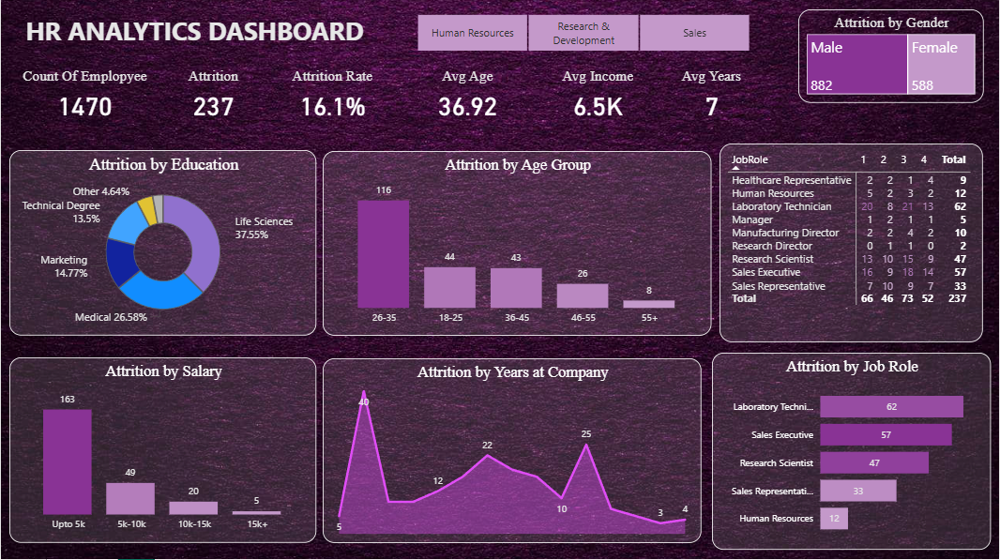
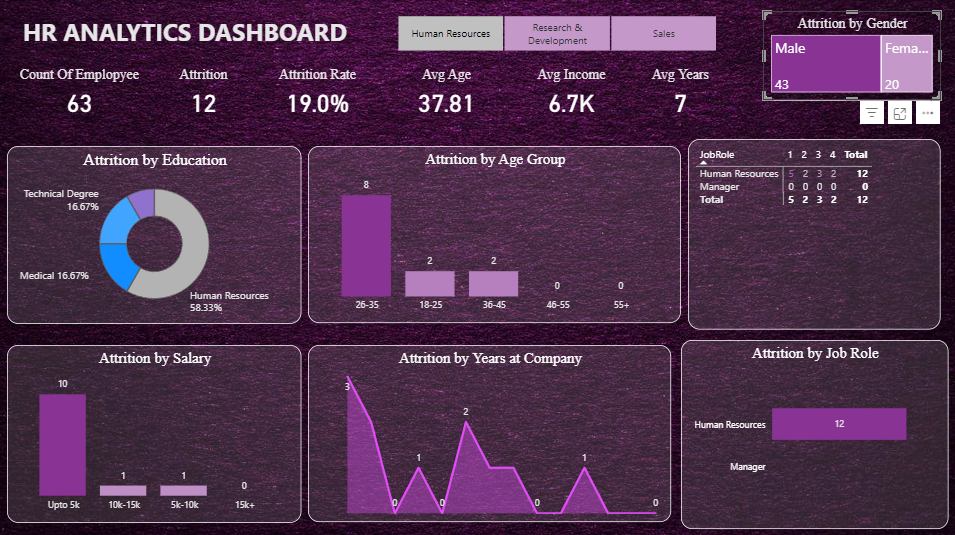

# HR Analytics — Employee Attrition Dashboard

## Problem Statement
Employee attrition is a costly challenge for organizations. This project analyzes 3,000+ employee records to identify the key drivers of attrition, helping HR teams make data-driven retention decisions.

## Dashboard Preview

## Key Insights
- Attrition rate was highest in the **Sales department** (21%)
- Employees with <2 years tenure had 3x higher attrition vs senior staff
- Low salary band (<30K) employees showed 35% attrition vs 8% in high band
- Performance rating had low correlation with attrition — tenure and salary mattered more

## Tools Used
| Tool | Purpose |
|------|---------|
| SQL | Data filtering, joins, attrition rate queries |
| Python (Pandas) | Data cleaning, EDA, correlation analysis |
| Power BI | Interactive dashboard development |
| Excel | Source data, Pivot Table summaries |

## Dataset
- 3,000+ employee records
- Fields: Department, Salary Band, Tenure, Performance Rating, Attrition status

## How to View
1. Download `HR_Attrition_Dashboard.pbix`
2. Open in Power BI Desktop (free download from Microsoft)
3. Interact with slicers to filter by department, salary, and tenure

## Contact
**R S Maneesh Adithiya** — Data Analyst
[LinkedIn](https://linkedin.com/in/maneesh-adithiya-82b10a235) | maneeshadithiya@gmail.com

